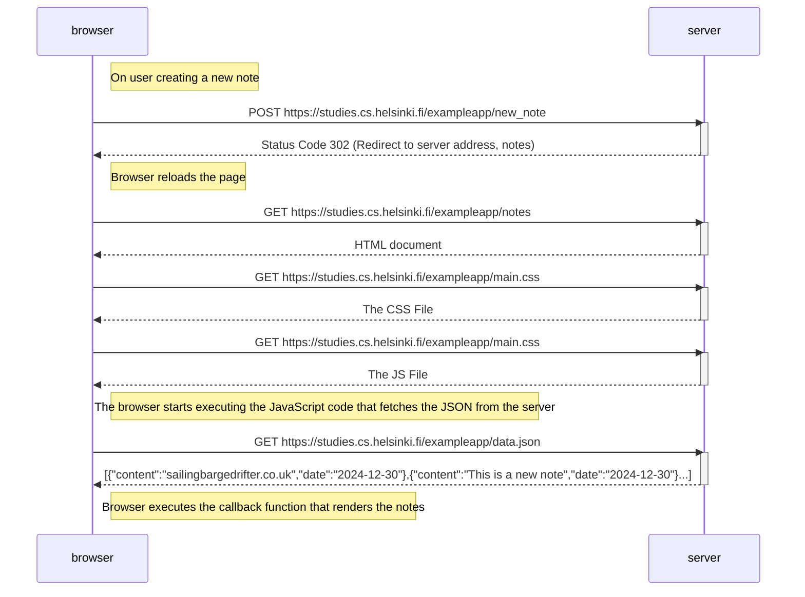

```mermaid

sequenceDiagram
    participant browser
    participant server

    Note right of browser: On user creating a new note 

    browser->>server: POST https://studies.cs.helsinki.fi/exampleapp/new_note
    activate server
    server-->>browser: Status Code 302 (Redirect to server address, notes)
    deactivate server

    Note right of browser: Browser reloads the page

    browser->>server: GET https://studies.cs.helsinki.fi/exampleapp/notes
    activate server
    server-->>browser: HTML document
    deactivate server

    browser->>server: GET https://studies.cs.helsinki.fi/exampleapp/main.css
    activate server
    server-->>browser: The CSS File
    deactivate server

    browser->>server: GET https://studies.cs.helsinki.fi/exampleapp/main.css
    activate server
    server-->>browser: The JS File
    deactivate server


    Note right of browser: The browser starts executing the JavaScript code that fetches the JSON from the server    


    browser->>server: GET https://studies.cs.helsinki.fi/exampleapp/data.json
    activate server
    server-->>browser: [{"content":"sailingbargedrifter.co.uk","date":"2024-12-30"},{"content":"This is a new note","date":"2024-12-30"}...]
    deactivate server
    

    Note right of browser: Browser executes the callback function that renders the notes

```
