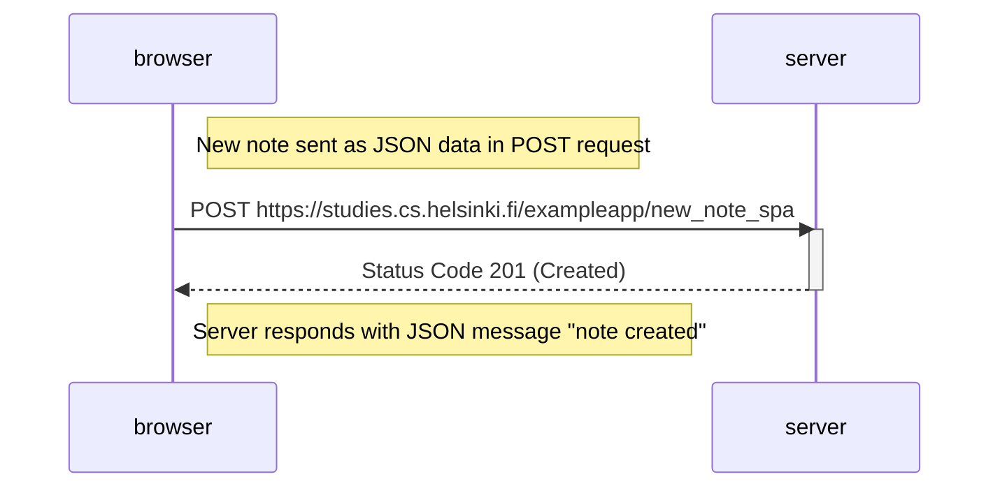

```mermaid

sequenceDiagram
    participant browser
    participant server

    Note right of browser: New note sent as JSON data in POST request

    browser->>server: POST https://studies.cs.helsinki.fi/exampleapp/new_note_spa
    activate server
    server-->>browser: Status Code 201 (Created)
    deactivate server
    
    Note right of browser: Server responds with JSON message "note created"
```
